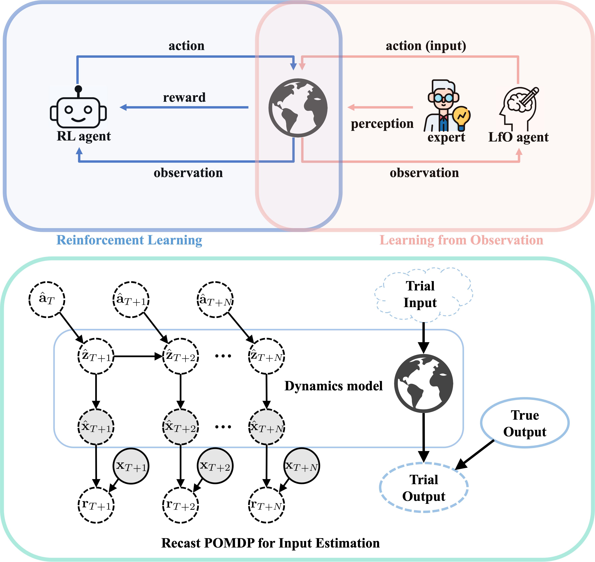

# ILfO-for-Input-Estimation

This repository contains codes and data for the following work:
* Wei Liu, Zhilu Lai, Charikleia D. Stoura, Kiran Bacsa, and Eleni Chatzi (2024). [Model-based Imitation Learning from Observation for Input Estimation in Monitored Systems](https://papers.ssrn.com/sol3/papers.cfm?abstract_id=4888238).

## Framework


## Repository Overview
 * `input_est` - Codes for implementing ILfO for input estimation.
   * `cem_halfcar.py` - Implementation of CEM for the formulated POMDP of the half-car system.
   * `cem_struc.py` - Implementation of CEM for the formulated POMDP of the linear structural system.
   * `data_car.mat` - Half-car system dataset.
   * `data_lin.mat` - Linear structural system dataset.
 * `vibration_ctrl` - Codes for implementing ILfO for vibration control.
   * `cem_struc.py` - Implementation of CEM for the formulated POMDP of the linear vibration system.
   * `data_lin.mat` - Linear vibration system dataset.

## Citation
Please cite the following paper if you find the work relevant and useful in your research:
```
@article{liu4888238model,
  title={Model-Based Imitation Learning from Observation for Input Estimation in Monitored Systems},
  author={Liu, Wei and Lai, Zhilu and Stoura, Charikleia D and Bacsa, Kiran and Chatzi, Eleni},
  journal={Available at SSRN 4888238}
}
```
